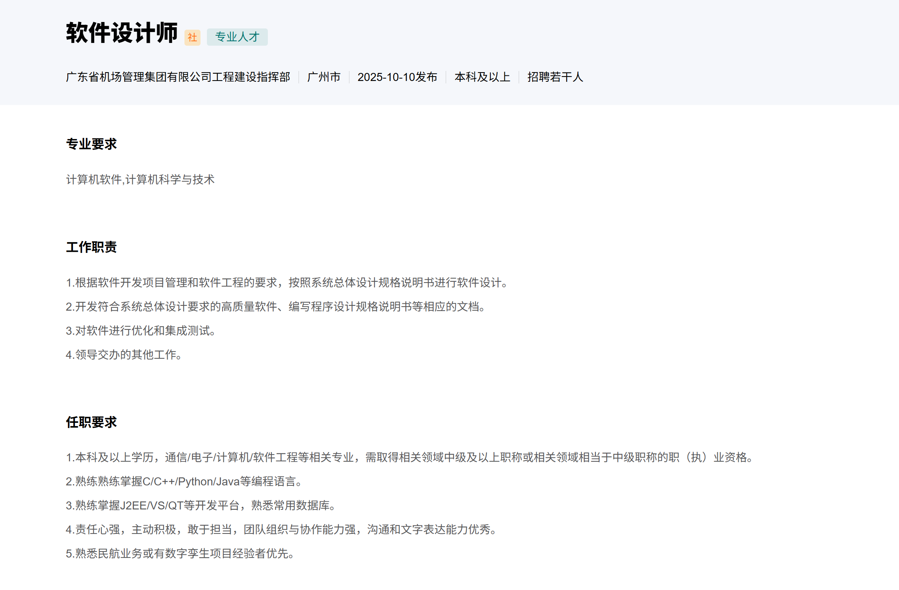

# Main

## Digital Twins & BIM 技术

### Known techiques

Nvidia omniverse nvdia的一个技术平台，用于方便企业接入实现 Digital twins。
甚至可以戴上 AR 或者 VR， MR 来实现观测。
而编辑器是一个基本组成。

具体可以查看 https://www.youtube.com/watch?v=Kvn0GKpydag&t=948s 
从 29 分钟开始，

## MyCareer overview

## My Study

## Personal Resume

## 职业规划

## JAVA WEB related

## Linux

## Requirement
