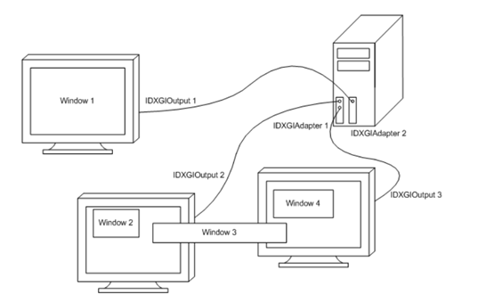

# Basic对象
里面有很多概念，我们逐一来讲解，可以先看看这里

<a href="https://zhuanlan.zhihu.com/p/634854048">知乎总结</a>

# DXGI对象

但是上面的介绍还少了一些具体的描述，
首先是 DXGI，这是个什么？他所包含的对象都有哪些？

<a href="https://learn.microsoft.com/zh-cn/windows/win32/direct3ddxgi/d3d10-graphics-programming-guide-dxgi">DXGI官方说明</a>

DXGI简单来讲，就是最终驱动硬件的接口，D3D是负责图形绘制（也就是画好一张图），但是不负责图形的输出（也就是发信号到显卡，显卡再输出到显示器），而DXGI负责这一块内容




DXGI为我们这些硬件抽象出来了一个软件对象的，显卡就是IDXGIAdapter，显示器就是IDXGIOutput，一般，一个显卡可以输出到多个显示器。
而在写代码的过程中，枚举这些对象的就是 IDXGIFactory。
虽然 IDXGIAdapter 是抽象出来的显卡对象，但是他只是这个显卡的描述，并不包含直接调用显卡的方法，真正代表显卡的是 IDXGIDevice，同时最重要的，IDXGIDevice就是绘制图形的API接口，你可以像理解文件系统一样看这个事情，IDXGIAdapter是文件头，而IDXGIDevice是真正的文件。


<a>https://learn.microsoft.com/zh-cn/windows/win32/api/DXGI/nn-dxgi-idxgidevice</a>

通过 IDXGIAdapter 可以创建出 IDXGIDevice。


另外一个值得说明的就是 <span style="color:red">**SwapChain**</span>，他也是 DXGI 的部分，只不过他的创建需要一个command queue对象。为什么呢？因为我们现在的d3d流程，并不是你cpu说要执行一个指令，gpu就执行，然后你cpu同步等待，而是并行的，cpu只提交指令，gpu什么时候执行，什么时候执行完，不知道，cpu也不等待，cpu只管提交指令，所以，一般写draw函数的时候，你会先用cpu提交一堆gpu指令，然后最后调用一次 swapchain.present()，而present肯定不能立马生效，因为他需要先执行了cpu前面的gpu指令，因此，swapchain.present()的设计肯定也是提交指令的模式，因此swapchain.present()就是相当于在 command queue 中加入多一条 present 的指令。


# D3D对象

由 d3d device 创建出来或者间接创建出来的对象，都是 D3D 对象

<a href= "https://learn.microsoft.com/en-us/windows/win32/direct3d12/command-queues-and-command-lists">command queue 和 command list</a>

先粗略去阅读下上面的文章，看看基本的流程（上面的帖子相当于d3d 的百科了。）


## Command queue， Allocator， List
Command list就是一堆gpu指令的集合，但是，他并不是存储gpu指令的地方，你应该把它看成一个接口，真正存储这些gpu指令的是Allocator，command list的作用是提供接口让你把gpu指令record到Allocator里面，Allocator本质上是一段连续内存，当调用 ExecuteCommandList的时候，就会从Allocator中拷贝这些指令到对应的显存然后执行。所以，如果你今天的gpu比较拉跨，cpu这边生成了一大堆gpu指令，但是gpu还没执行完前面的指令，你就相当于需要弄多几个 Allocator 把指令缓存起来，你在调用ExecuteCommandList只是告诉Command queue把这些缓存拼起来，等gpu慢慢执行过来。这也是为什么gpu还没执行完一个allocator上的指令的时候，你可以随意调用command list的reset接口，因为command list并不是一个真正的gpu指令对象，他只是一个接口，真正的数据在allocator，你在它reset的时候传入新的allocator即可。
为什么要这样的设计，主要就是为了让cpu和gpu可以不同步，可以充分利用cpu的多核性能，gpu那边也可以尽情优化自己的指令。


## Fence
试想一个情况，你想要让gpu算一个东西，然后你cpu等gpu算好了再去读取并使用，那么你就要让cpu等待一下gpu，那么fence就是这么个用途，一开始你在cpu端设置fence=0，然后你在command list的尾巴插入令 fence = 1的指令，那么cpu只有当执行完这个commandlist后，才会将fence赋值为1，而这期间，你cpu就可以不断去轮询fence的值，只要还没达到cpu就一直等。听着是不是很像多线程里面的信号量


## View
在gpu中，会经常有各种buffer，texture（我们称他们为resource，他们是位于显存上得），他们是gpu运行时候实际上的显存资源，比如当我要sample一个texture的时候，我就需要告诉gpu从你显存的哪里，去哪个地方开始读取，而这正是view要做的事情，view要告诉gpu从哪个resource上读取，这就是我们绑定resource的原因，多个view可以绑定同一个resource，比如不同的view分别指定同一个buffer的不同部分。那么view存在我们cpu哪里呢？他其实就是desc，通常是需要用一个heap来存储，这个heap是一段连续内存，一个desc就用heap的一个指针（desc_handle）来表示，一个heap只能存储一种desc，所以一般会创建多个heap。说了那么多还没说到view是什么，其实view就是desc，创建view的过程就是创建desc。

### 关于view的一些问答

#### SwapChainBuffer 和 DepthStencilBuffer 都是ID3D12Resource，这个具体是什么？这两个buffer是在哪一步被创建的

SwapChainBuffer和DepthStencilBuffer都是ID3D12Resource对象，它们在DirectX 12中代表GPU可访问的资源。我来解释它们的本质和创建过程：

ID3D12Resource是DirectX 12中表示GPU资源的接口，可以代表多种类型的资源：

1. 纹理（1D、2D或3D）
2. 缓冲区（顶点缓冲区、索引缓冲区、常量缓冲区等）
3. 渲染目标
4. 深度/模板缓冲区

这些资源存在于GPU内存中，由Direct3D进行管理。

**SwapChainBuffer的创建**

SwapChainBuffer（后台缓冲区）是在以下两个阶段创建的：

1. 初始创建：通常在应用程序初始化时（如Initialize或Init方法中）通过创建交换链时隐式创建：
```cpp
// 创建交换链示例代码
SwapChainDesc swapChainDesc = {...};
ThrowIfFailed(mdxgiFactory->CreateSwapChain(
    mCommandQueue.Get(),
    &swapChainDesc,
    mSwapChain.GetAddressOf()));
```

2. 在此代码中的获取：
```cpp
// 获取交换链已创建的缓冲区
for (UINT i = 0; i < SwapChainBufferCount; i++)
{
    ThrowIfFailed(mSwapChain->GetBuffer(i, IID_PPV_ARGS(&mSwapChainBuffer[i])));
    // 创建视图...
}
```
这一步并不是创建资源，而是获取交换链中已有的缓冲区的引用。交换链内部已经分配了这些缓冲区，这里只是获取其接口指针。


**DepthStencilBuffer的创建**

深度/模板缓冲区在这段代码中是显式创建的：
```cpp
ThrowIfFailed(md3dDevice->CreateCommittedResource(
    &CD3DX12_HEAP_PROPERTIES(D3D12_HEAP_TYPE_DEFAULT),
    D3D12_HEAP_FLAG_NONE,
    &depthStencilDesc,
    D3D12_RESOURCE_STATE_COMMON,
    &optClear,
    IID_PPV_ARGS(mDepthStencilBuffer.GetAddressOf())));
```

这个调用明确地:

1. 在默认堆上分配资源（D3D12_HEAP_TYPE_DEFAULT，通常是GPU访问最优的内存）
2. 根据之前设置的描述符创建2D纹理资源
3. 设置初始状态为D3D12_RESOURCE_STATE_COMMON
4. 提供优化的清除值
5. 将创建的资源接口存储在mDepthStencilBuffer中

**两者的区别**

1. **SwapChainBuffer**：由交换链管理，用于存储渲染结果并最终呈现到屏幕上。在窗口大小变化时，需要调整这些缓冲区的大小，但不需要重新创建交换链本身，只需调用ResizeBuffers方法。
2. **DepthStencilBuffer**：独立创建的资源，用于存储每个像素的深度和模板值，辅助3D渲染中的深度测试和模板测试。在窗口大小变化时，需要完全重新创建这个资源。


#### 那rendertargetview以及DepthStencilView都是存在哪里得？他们会被怎么使用？
渲染目标视图(RenderTargetView)和深度模板视图(DepthStencilView)都是描述符(Descriptor)，它们存储在描述符堆(Descriptor Heap)中，并在渲染过程中使用


#### CreateCommittedResource 是一种创建资源的方式，还有其他创建资源的方式嘛？
在DirectX 12中，创建资源有几种不同的方式，每种方式适用于不同的场景和需求。CreateCommittedResource是最常用的方法，但并不是唯一的方法。

DirectX 分配资源的概念是类似我们CPU上分配的概念，需要先创建一段内存（也就是堆），然后再进行初始化，比如下面的这种
```cpp
// 第一步：创建堆
D3D12_HEAP_DESC heapDesc = {};
heapDesc.SizeInBytes = 1024 * 1024; // 1MB
heapDesc.Properties.Type = D3D12_HEAP_TYPE_DEFAULT;
heapDesc.Properties.CPUPageProperty = D3D12_CPU_PAGE_PROPERTY_UNKNOWN;
heapDesc.Properties.MemoryPoolPreference = D3D12_MEMORY_POOL_UNKNOWN;
heapDesc.Alignment = D3D12_DEFAULT_RESOURCE_PLACEMENT_ALIGNMENT;
heapDesc.Flags = D3D12_HEAP_FLAG_ALLOW_ONLY_BUFFERS; // 可以限制堆的用途

ComPtr<ID3D12Heap> customHeap;
ThrowIfFailed(device->CreateHeap(&heapDesc, IID_PPV_ARGS(&customHeap)));

// 第二步：在堆上创建资源
UINT64 heapOffset = 0; // 在堆中的偏移量
ThrowIfFailed(device->CreatePlacedResource(
    customHeap.Get(),       // 使用创建的堆
    heapOffset,            // 堆内偏移
    &resourceDesc,         // 资源描述
    initialState,          // 初始状态
    nullptr,               // 优化的清除值（可选）
    IID_PPV_ARGS(&placedResource)));
```
优点就是：
1. 更灵活地控制内存分配
2. 可以在同一个堆上创建多个资源，节省内存
3. 支持资源别名（多个资源共享相同的内存位置）
4. 可以更精细地控制资源布局

而 **CreateCommittedResource** 这个方法，本质上就是我们cpu上的new操作，分配内存并且初始化了。
