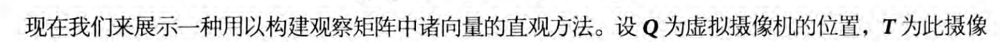
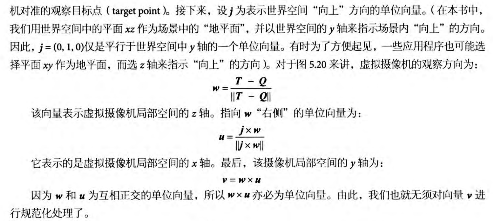
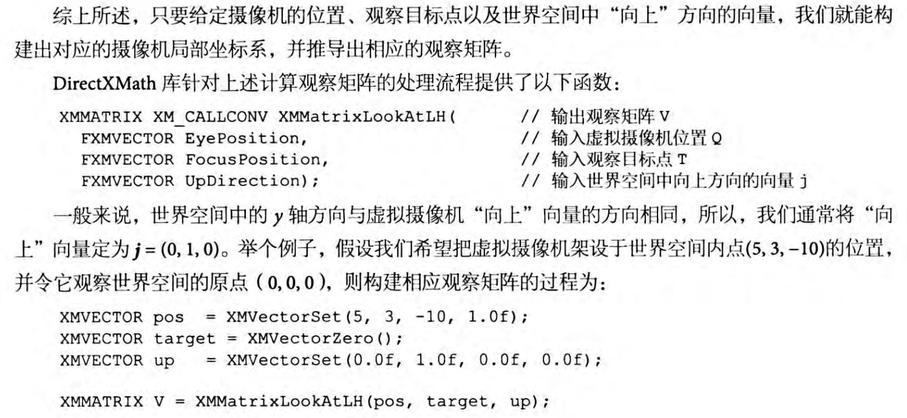
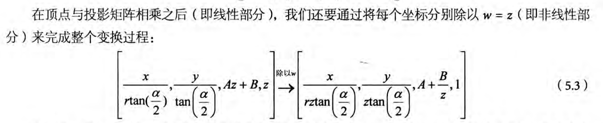
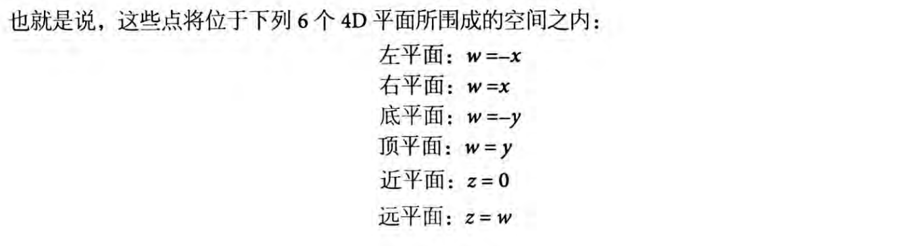
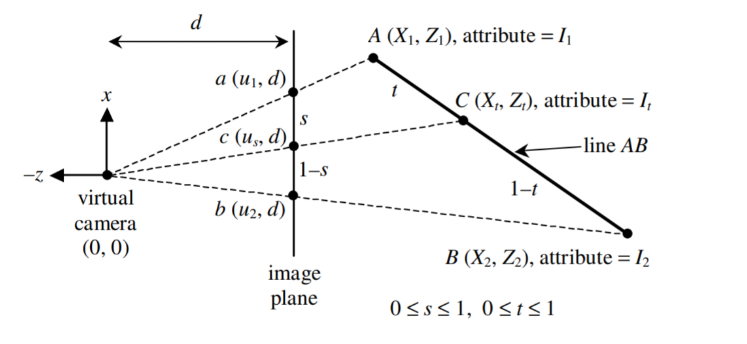

# View矩阵

首先，不同坐标系下，比如 A 坐标系中 p 的坐标是 (x_a, y_a, z_a) ，那么 这个点 p 在 B 坐标系中的坐标是多少？

回答这个问题，你要先明白，坐标是什么，坐标的本质是投影，你只需要知道 B 坐标系他的基底是多少，那么只需要计算 p 在这些基底的投影不就能得到 p 在 B 中的坐标了么？

d3d提供的function确实就是按照这个思路去快速变换坐标系的，他是通过一个基底，构建出一个其他两个基底，得到一个完整的坐标系，然后再去算投影

 
 
 
 

# Project矩阵，齐次裁剪空间/投影空间，NDC

这一章节在书里的 5.6.3 开始，讲的非常好，整个推理也是非常完整。

其中，D3D的 **齐次裁剪空间** 指的是，在未进行除w之前的那个空间。

而 D3D 的 **NDC** 是 [-1, 1] * [-1, 1] * [0, 1] 的区间

 
 
 
 

# Clip

关于裁剪算法，可以参考 <a href="https://github.com/phenomLi/Blog/issues/30">Sutherland Hodgman</a>

另外就是，在实际用的时候，不是直接拿世界坐标的点去进行裁剪，而是先把坐标转成 **齐次裁剪空间** 的坐标后才进行下一步求交点（主要就是和那6个4D平面求交）

这里我们介绍具体的裁剪办法，首先你能想到的最简单的裁剪，是不是就是判断出这个点是否在有效的空间范围内，如果不在，就舍弃这个顶点，这样确实可以，但是他会导致下面的问题

 

你认真看上面的图，你会发现，裙子和头那里丢了很多面片，这是因为有些面片比较大（也就是顶点与顶点之间距离比较远），那么你丢了那个顶点后，相当于就是丢了整块面片，这样的效果当然差，比较好的方式应该是给他补回这些面片，粗暴的丢弃顶点不合适。

可以参考下这个链接 <a href="https://blog.csdn.net/qq_38065509/article/details/107473644">**Homogeneous Space Clipping**</a>，不过这个链接基于opengl，所以他的裁剪空间和d3d的不太一样，包括用的也不是左手定则，而是右手定则，看的时候注意区分。另外一个重要的事情就是，你补上新的顶点后，顶点顺序注意别弄乱了，否则后续的背面剔除会出问题。

 
 
 
 

# 光栅化

D3D的光栅化流程是这样的，先是将上面求到的 NDC 坐标 转为 屏幕坐标 （视口变换），需要注意，一般这个过程中，顶点的 z 值是不会变化的，但是你可以指定他映射到某个范围。

然后是进行背面剔除，因为d3d是左手定则，所以顺时针是正面朝向，逆时针才是背面朝向，当然这个也是可以通过在渲染管线中修改得。

最后才是顶点属性插值，关于这个，建议看下面列出的帖子
1. <a href="https://blog.csdn.net/qq_38065509/article/details/105418437">光栅化直线，三角形</a>，这个主要告诉你怎么绘制一个直线，然后就是判断一个像素是否在三角形内部（bounding box + 叉乘 判断），决定是否生成片元

2. <a href="https://blog.csdn.net/qq_38065509/article/details/105446756">重心坐标求解</a>

3. <a href="https://blog.csdn.net/qq_38065509/article/details/105878504">透视矫正插值</a>，主要利用三角形重心坐标来进行插值

其中， X1, Z1, u1, d 这些都是坐标，属性是 **I** ，
你可以不用去管整个正面过程，本质要做的就是已知到 s 的情况（通过重心坐标计算），算出对应的 t 是多少，然后再用 t 去插值出 I。另外就是整个证明过程，证明了一个事情，就是这个 t 值得计算，并不需要原始位置属性的其他值，只需要一个 Z 坐标的值，而我们知道，齐次裁剪空间的 w 实际上就是 原始位置属性的 Z 坐标值，所以正好就联系起来了。

结论是 1/Z 和 I/Z 在屏幕空间上是线性相关的，

1/Z_t = s * (1/Z_1) + (1-s) * (1/Z_2)

I_t/Z_t = s * (I_1/Z_1) + (1-s) * (I_2/Z_2)

因此，你只需要去算出重心坐标以及三个投影点的 I/Z ，既可插值得到 I_t/Z_t，之后再插值得到 1/Z_t，两个相除即可得到 I_t

# 关于 SV_POSITION 的 w

我们前面说过，顶点的 position 经过的变化是这样的

p_origin * MVP = p_clipspace，从原始position转为齐次裁剪空间坐标，而从前面的推导可以直到，p_clipspace 的 w 其实是 p_origin * MV 的 z值，也就是 p_origin 经过 Model 以及 View 的变换后得到的坐标的z值。

p_ndc = (p_clipspace.xyz / p_clipspace.w, p_clipspace.w)，从 齐次裁剪空间坐标转为 NDC 坐标，其中，并不会修改 w 值，w值还是我们上面说的那个值，也就是 p_origin 经过 Model 以及 View 的变换后得到的坐标的z值。

p_screen = p_ndc * T_viewport，再从 NDC 坐标转为 屏幕坐标，而这个转化，只是修改 xy 值， z和w不会改变。

然后在光栅化阶段，片元被插值出来，而片元的 SV_POSITION 表示的是这个片元的屏幕坐标，也就是插值出来的 p_screen，w 同样也会被插值出来。

但是，我们一般不会让 Fragment shader 直接去用 SV_POSITION，尤其是计算光照的时候，我们会让经过 M 变换的 position 作为这个面片在真实世界中的坐标，作为一个属性被插值出来。

关于这个话题，可以参考这个链接 <a href="https://zhuanlan.zhihu.com/p/597918725?utm_psn=1893386443176535648">HLSL的SV_POSITION</a>