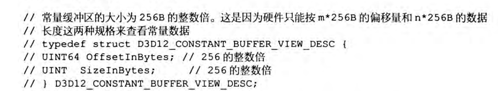

# 需要从cpu搬运数据到gpu的缓冲中： vertex buffer， indice buffer

```cpp
Microsoft::WRL::ComPtr<ID3D12Resource> d3dUtil::CreateDefaultBuffer(
    ID3D12Device* device,
    ID3D12GraphicsCommandList* cmdList,
    const void* initData,
    UINT64 byteSize,
    Microsoft::WRL::ComPtr<ID3D12Resource>& uploadBuffer)
{
    ComPtr<ID3D12Resource> defaultBuffer;

    // Create the actual default buffer resource.
    ThrowIfFailed(device->CreateCommittedResource(
        &CD3DX12_HEAP_PROPERTIES(D3D12_HEAP_TYPE_DEFAULT),
        D3D12_HEAP_FLAG_NONE,
        &CD3DX12_RESOURCE_DESC::Buffer(byteSize),
		D3D12_RESOURCE_STATE_COMMON,
        nullptr,
        IID_PPV_ARGS(defaultBuffer.GetAddressOf())));

    // In order to copy CPU memory data into our default buffer, we need to create
    // an intermediate upload heap. 
    ThrowIfFailed(device->CreateCommittedResource(
        &CD3DX12_HEAP_PROPERTIES(D3D12_HEAP_TYPE_UPLOAD),
		D3D12_HEAP_FLAG_NONE,
        &CD3DX12_RESOURCE_DESC::Buffer(byteSize),
		D3D12_RESOURCE_STATE_GENERIC_READ,
        nullptr,
        IID_PPV_ARGS(uploadBuffer.GetAddressOf())));


    // Describe the data we want to copy into the default buffer.
    D3D12_SUBRESOURCE_DATA subResourceData = {};
    subResourceData.pData = initData;
    subResourceData.RowPitch = byteSize;
    subResourceData.SlicePitch = subResourceData.RowPitch;

    // Schedule to copy the data to the default buffer resource.  At a high level, the helper function UpdateSubresources
    // will copy the CPU memory into the intermediate upload heap.  Then, using ID3D12CommandList::CopySubresourceRegion,
    // the intermediate upload heap data will be copied to mBuffer.
	cmdList->ResourceBarrier(1, &CD3DX12_RESOURCE_BARRIER::Transition(defaultBuffer.Get(), 
		D3D12_RESOURCE_STATE_COMMON, D3D12_RESOURCE_STATE_COPY_DEST));
    UpdateSubresources<1>(cmdList, defaultBuffer.Get(), uploadBuffer.Get(), 0, 0, 1, &subResourceData);
	cmdList->ResourceBarrier(1, &CD3DX12_RESOURCE_BARRIER::Transition(defaultBuffer.Get(),
		D3D12_RESOURCE_STATE_COPY_DEST, D3D12_RESOURCE_STATE_GENERIC_READ));

    // Note: uploadBuffer has to be kept alive after the above function calls because
    // the command list has not been executed yet that performs the actual copy.
    // The caller can Release the uploadBuffer after it knows the copy has been executed.


    return defaultBuffer;
}
```

我们知道，swapChain 上的 buffer 由 swapChain 自己创建和管理，而 vertex buffer 和 indice buffer 都是开发者自己塞数据的，所以需要自己去管理。上面的代码展示了这个过程，简而言之是这几个步骤

1. 首先创建一个默认堆类型(D3D12_HEAP_TYPE_DEFAULT)的资源缓冲区，这种类型的缓冲区对GPU访问是最优化的，但CPU不能直接写入。
2. 创建一个上传堆类型(D3D12_HEAP_TYPE_UPLOAD)的临时缓冲区，这种类型的缓冲区允许CPU写入数据。
3. 设置数据描述结构(D3D12_SUBRESOURCE_DATA)，指定要复制的源数据（这个就是我们传过去的数据）。
4. 使用资源屏障(ResourceBarrier)将默认缓冲区的状态从COMMON转换为COPY_DEST，准备接收数据。
5. 调用UpdateSubresources辅助函数，该函数将CPU内存中的数据先复制到上传缓冲区，然后从上传缓冲区复制到默认缓冲区。
6. 再次使用资源屏障将默认缓冲区的状态从COPY_DEST转换为GENERIC_READ，表示复制完成，现在可以被GPU读取。
7. 函数返回创建的默认缓冲区，但注意上传缓冲区(uploadBuffer)通过引用传递给了调用者，因为命令列表中的复制操作可能还没有执行，所以上传缓冲区必须保持有效直到命令执行完成。

为什么要费劲心思先把 cpu 的数据放到 一个位于 gpu 的 upload 缓存？ 然后再把 upload 缓存拷贝到 目标缓存？

在DirectX 12中需要上传缓冲区的主要原因与GPU和CPU内存访问模式以及性能优化有关：

1. 内存访问模式差异：
    * 默认堆(D3D12_HEAP_TYPE_DEFAULT)中的资源对GPU访问是优化的，GPU可以高效读取这些资源，但CPU通常无法直接写入，地址通常指向GPU专用内存
    * 上传堆(D3D12_HEAP_TYPE_UPLOAD)则允许CPU写入，但对GPU的读取效率较低，地址通常指向cpu内存

2. 直接内存传输的限制：
    * DirectX 12不允许直接从CPU内存复制到默认堆，必须通过中间步骤。
    * 这是由硬件架构决定的，现代GPU与CPU通常使用不同的内存空间或访问模式。

3. 性能优化：
    * 默认堆通常位于GPU可以最高效访问的内存中(如显存)。
    * 使用上传缓冲区作为中介，让数据传输遵循硬件优化路径，提高整体性能。
4. 异步执行模型：
    * DirectX 12使用命令列表进行异步操作。
    * 上传缓冲区作为暂存区，在GPU实际执行命令前保持数据的有效性。

简言之，上传缓冲区是CPU和GPU高效数据交换的桥梁。它遵循"写入一次，多次读取"的模式——CPU写入上传缓冲区，然后GPU将数据复制到默认缓冲区，之后GPU可以多次高效读取该数据而无需再与CPU交互。

需要注意的是，上传缓冲区必须保持有效直到GPU完成相关命令的执行，这就是为什么代码中有注释提醒调用者不要过早释放上传缓冲区。    

<br>
<br>
<br>
<br>

# 常量缓存
只需要留意一个事情，常量缓存区中，gpu只能这样取地址 ptr = m x 256 B，并且 取值的时候也是 size = n x 256 B，你可以类比我们cpu那边的内存对齐，内存对齐的目的不就是降低cpu取一个数值的时候避免多次取，这个gpu也是同样的。

因为上面所说的 gpu 取地址原因，所以为了能访问到常量缓存中的每个元素，要求每个元素都是 256 对齐的

这个在你创建 常量缓存 的 view 的时候也是要确保的




<br>
<br>
<br>
<br>


# 资源绑定

看资源绑定，主要是要先了解 dx12 的内存管理，在 dx12 中，内存本质上是分为 系统内存（sysMem）和 gpu 显存 (Vram)。

在 dx12 的框架下，cpu 能读写 vram， 同样，gpu 也能读写 sysMem，如果是独立显卡，那么就是通过 pcie 完成这个过程，而如果是集成显卡，则是 vram = sysMem （大多数情况下）

为了方便解读这个内存结构，建议先阅读 <a href="https://zhuanlan.zhihu.com/p/5525463122">DirectX12 随笔-显存</a>

其次，需要看看 dx12 相比旧api，比如 opengl ，他都具体做了什么性能提升？阅读 <a href="https://zhuanlan.zhihu.com/p/149721407"> 渲染引擎开发:D3D12 Descriptor管理 </a>

主要弄明白 pipeline state，resource，heap以及 descriptor这些概念。

什么是 pipeline state，我们知道在 opengl 里面经常要 设置顶点着色器，设置像素着色器，设置输入布局等等，这些类似于状态的设置，我们不可能每帧去执行，因为它内部是有cpu性能损耗的，所以 dx12 是鼓励我们多创建几个 pipeline state object，缓存下来，然后 dx12 会去优化这些指令，你最好不要每帧去修改 pso，只需要创建足够多的 pso（一次创建），然后每帧根据需要绑定不同的 pso 到渲染管线上，这样的性能最佳。

什么是 resource，resource是相对 gpu 而言的，它可以是一个buffer，可以是一个texture。但是 resource 在 dx12 中并不是说只存在于 vram，我们前面说过，gpu 也能反过来读取 sysMem，因此 resource 有存放在 sysMem，也有存放在 vram 的，resource 具体在哪呢？他就在 dx12 的 heap 中。

什么是 heap，dx12的 heap 就是连续的逻辑内存段（逻辑内存地址其实就是虚拟内存地址，建议看本地文档 **操作系统的内存管理.docx** ），dx12 的 heap 有分配在 sysMem 的，也有分配在 vram 的，具体对 cpu 读写友好还是 对 gpu 读写友好，这个你要仔细看前面的 <a href="https://zhuanlan.zhihu.com/p/5525463122">DirectX12 随笔-显存</a>

重点来了，什么是 descriptor？强烈建议先看这两个文章：<a href="https://zhuanlan.zhihu.com/p/424785264">游戏引擎编程实践（1）- DirectX 12显存分配</a>， <a href="https://zhuanlan.zhihu.com/p/424992591">游戏引擎编程实践（2）- DirectX 12描述符管理</a>， 他里面还引用到了另一个文章，
<a href="https://zhuanlan.zhihu.com/p/129257338">游戏引擎随笔 0x10：现代图形 API 实战回顾-D3D12 篇</a>，最后是看这个文章 
<a href="https://zhuanlan.zhihu.com/p/425391931">游戏引擎编程实践（3）- DirectX 12资源绑定</a>

其实， descriptor 就是 resource 的头文件，他是有一定大小的，descriptor handle 就是 descriptor 的指针。里面最常让人困惑的，其实是为什么有 cpu descriptor 以及 gpu descriptor，简单点来说，gpu descriptor 就是只能被 shader 读取的，比如 sampler，SRV。而 cpu descriptor 则是什么都可以，那为什么要有这两个呢？原因是因为 gpu 上能放的 descriptor 数量是有限的，具体为什么我也不知道，以后可以去看看 gpu 硬件相关的文章，所以，通常会创建 cpu descriptor 缓存起来，然后当你需要修改绑定的资源时候，你就拷贝 cpu descriptor 到对应的 gpu descriptor，而这个过程不是立刻执行的，而是通过 command queue 执行，所以你要保证 cpu descriptor 他在gpu执行拷贝指令的时候，是要保持住的，这也是为什么，一直都会有人在处理 descriptor 的 内存管理，而这个处理方式，其实和我们 操作系统 处理内存是类似的。

另外这里提供官方对 descriptor 的文档 <a href="https://learn.microsoft.com/en-us/windows/win32/direct3d12/descriptors"> descriptor </a>


这里再推荐个文章 <a href="https://asawicki.info/news_1754_direct3d_12_long_way_to_access_data">Direct3D 12: Long Way to Access Data</a>，这个文章想说，cpu 把 sysMem 的数据传给 gpu 的 vram 要经过多少处理，有三种方式，具体看文章。


<br>
<br>
<br>
<br>

# 根签名

看完这个文章就行了 
<a href="https://asawicki.info/news_1778_shapes_and_forms_of_dx12_root_signatures">Direct3D 12: Shapes and forms of DX12 root signatures</a>

根签名其实就是编译全局绑定信息（注意，比如vertex buffer并不是全局，而是这个shader特定的输入，由输入布局来决定），根签名只是指定了资源的格式以及他的绑定变量对应名称（比如shader中的这个sampler应该去哪个类型的buffer的哪个槽读取），所以根签名是和shader高度绑定的，所以甚至有些写法，是直接将根签名包含在shader中，shader编译的时候自行编译出根签名，那为什么还是要分离设计呢？这部分的显存消耗真的值得嘛？

我先说明下 HSLS 代码中的 register 具体是什么意思

```cpp
// 着色器中:
cbuffer cbPerObject : register(b0)
{
    float4x4 gWorldViewProj;
};
```
```cpp
// C++应用中:
// 创建三个不同的常量缓冲区
ID3D11Buffer* objectABuffer;
ID3D11Buffer* objectBBuffer;
ID3D11Buffer* objectCBuffer;

// 渲染对象A
UpdateBuffer(objectABuffer, objectAMatrix);
context->VSSetConstantBuffers(0, 1, &objectABuffer); // 绑定到b0
DrawObject(objectA);

// 渲染对象B
UpdateBuffer(objectBBuffer, objectBMatrix);
context->VSSetConstantBuffers(0, 1, &objectBBuffer); // 同样绑定到b0
DrawObject(objectB);
```
像这里，register(b0) shader编译后，他只知道，cbPerObject 是一个 constant buffer 类型，而且是在这个类型的第几个槽，其他他不知道，他就像一个指针变量，等待这个指针变量有真正的地址。真正知道这些的，只有当你执行到对应的 PSO 的时候，你才知道。
