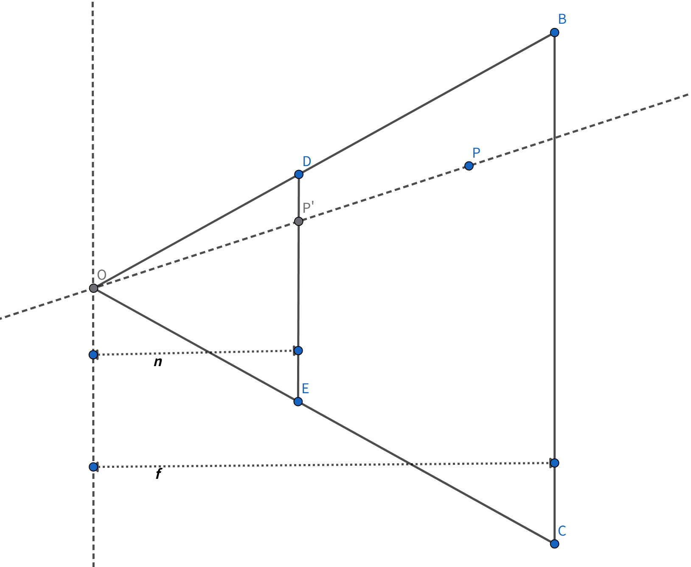

# Model 矩阵

这个要计算的是在 Object 上的某一个点，以世界坐标 origin 为中心，经过缩放以及平移后所在的位置

# View 矩阵

这个实际上要计算的是在 Object 上的某一个点，他在 Camera 的局部坐标系中，应该是什么坐标，本质就是问，这个点相对于 Camera 的位置是多少。
那么这个东西其实是有一个非常明了的公式：

$ \mathbf{p} = \mathbf{p}_{camera} + \mathbf{p}' $

其中，$ \mathbf{p} $ 是那个点在世界坐标系中的位置，$ \mathbf{p}_{camera} $ 是 Camera 在世界坐标系中的位置，$ \mathbf{p}' $ 是那个点相对于 Camera 的位置。相对于 Camera 的位置 其实就是算这个点 在 Camera 的坐标系中，他的投影分量是多少，假设这个投影分量是 
$
\begin{bmatrix}
x' \\
y' \\
z'
\end{bmatrix}
$
，然后 Camera 的基底是 { $ e_1', e_2', e_3' $ }
，那么有下面的等式

$ \mathbf{p}' =  
\begin{bmatrix}
\,|\, & \,|\, & \,|\, \\
e_1' & e_2' & e_3'\\
\,|\, & \,|\ & \,|\,
\end{bmatrix}
\begin{bmatrix}
x' \\
y' \\
z'
\end{bmatrix}
$

那么，要求
$
\begin{bmatrix}
x' \\
y' \\
z'
\end{bmatrix}
$
就会很简单了，直接反推即可

$ \begin{bmatrix}
\,|\, & \,|\, & \,|\, \\
e_1' & e_2' & e_3'\\
\,|\, & \,|\ & \,|\,
\end{bmatrix}^{-1}(\mathbf{p} - \mathbf{p}_{camera}) = \begin{bmatrix}
x' \\
y' \\
z'
\end{bmatrix}  $

其中，因为{ $ e_1', e_2', e_3' $ } 基底互相垂直，所以 
$\begin{bmatrix}
\,|\, & \,|\, & \,|\, \\
e_1' & e_2' & e_3'\\
\,|\, & \,|\ & \,|\,
\end{bmatrix}$  是个正交矩阵，他的逆矩阵是 
$\begin{bmatrix}
\,-\, & \,e_1'\, & \,-\, \\
\,-\ & e_2' & -\\
\,-\, & \,e_3'\ & \,-\,
\end{bmatrix}$ 

因此，求取这个 View Matrix 是很简单的，只需要 Camera 的 Position，以及 Camera 的基底，而 Camera 的基底，一般都是通过 LookDir 以及 Camera 的 Right 来算出来，这里不再赘述，算出基底后，就能拼出那个逆矩阵，有了逆矩阵，还没结束，我们知道 $(\mathbf{p} - \mathbf{p}_{camera}) $ 其实就是一个位移分量，把这个位移分量再拼上前面的3x3逆矩阵，就能得到一个完整4x4齐次矩阵。也就是

$\begin{bmatrix}
\,-\, & \,e_1'\, & \,-\, & \,-C_{x}\,\\
\,-\ & e_2' & -& \,-C_{y}\,\\
\,-\, & \,e_3'\ & \,-\,& \,-C_{z}\,\\
\,0\, & \,0\ & \,0\,& \,1\,\\
\end{bmatrix}$ 
$C$ 表示 Camera 的 Position 

 

# PROJECT 矩阵

印象中总会觉得投影矩阵特别难推理，其实很简单，主要是以前一直没弄清楚他的一些严格定义，今天完整推导一次

首先，我们从俯视图出发，这里的世界坐标原点在点 $ O $, 然后往右是 $z$ 轴正方向，往上是 $x$ 轴正方向，而点 $P$ 是我们在 View 空间坐标系中的一个点，记他的坐标为 $(x, y, z)$, 然后点 $P$ 经过投影后变成点 $P'$（坐标是$(x', y', z')$），实际上就是连接 $OP$ 然后穿过平面 $DE$ （俯视图来看就是一个线段），经过的交点就是点 $P'$，稍微补充一下，$DE$ 是近平面，距离点 $O$ 的垂直距离是 $n$，而 $BC$ 是远平面，距离原点是 $f$。那么我们的目标就是用一个矩阵乘上$(x, y, z)$后得到点$P'$的坐标，因此我们需要先确定点$P'$的坐标是多少。

稍微用点三角形的相似原理，你就能推出 $x' = \dfrac{nx}{z}$，同理，上面的图如果不是俯视图，而是右视图，你也能推出  $y' = \dfrac{ny}{z}$，那么我们现在好奇的是 $z'$ 是多少？所以这里引出
近平面和远平面的作用，他其实是三个限定条件，点如果不在近平面和原平面之间，将不会有投影点，而如果一个点在近平面上，则他的投影点的$z'$值，将会是 $0$，而如果一个点在远平面上，则他的投影点的$z'$值，将会是 $1$。这是一种归一化的限定，并没有说非得这样弄，你完全可以用别的标准去设计你的$z'$值，只不过目前业界都用这一套。上面的话用表达式表示就是

if $P$ is $(\;x, \;y, \;n\;)$

then $P'$ = $(\;\dfrac{nx}{z}, \;\dfrac{ny}{z}, \;0\;)$

if $P$ is $(\;x, \;y, \;f\;)$

then $P'$ = $(\;\dfrac{nx}{z}, \;\dfrac{ny}{z}, \;1\;)$

我们想用一个 **常量** 矩阵（齐次矩阵）来乘上 $P$ 得到 $P'$，那么应该如何想呢？上面的表达式可以再写的更具体一点

$\begin{bmatrix}
\,-\, & \,e_1\, & \,-\, & \,-\,\\
\,-\ & e_2 & -& \,-\,\\
\,-\, & \,e_3\ & \,-\,& \,-\,\\
\,-\, & \,e_4\ & \,-\,& \,-\,\\
\end{bmatrix}
\begin{bmatrix}
x \\
y \\
n \\
1
\end{bmatrix}=\begin{bmatrix}
\dfrac{nx}{z} \\
\\
\dfrac{ny}{z} \\
\\
0 \\
\\
-\\
\end{bmatrix}
\;\;\;\;(1)
$

$\begin{bmatrix}
\,-\, & \,e_1\, & \,-\, & \,-\,\\
\,-\ & e_2 & -& \,-\,\\
\,-\, & \,e_3\ & \,-\,& \,-\,\\
\,-\, & \,e_4\ & \,-\,& \,-\,\\
\end{bmatrix}
\begin{bmatrix}
x \\
y \\
f \\
1
\end{bmatrix}=\begin{bmatrix}
\dfrac{nx}{z} \\
\\
\dfrac{ny}{z} \\
\\
1 \\
\\
-\\
\end{bmatrix}
\;\;\;\;(2)
$

留意到我特意给变换后的向量的齐次坐标的最后一个分量给了个 $-$ 这样的符号，并不是不知道他是多少，而是不管他是多少先。

我们从第一个式子中可以知道

$\begin{bmatrix}
\,-\, & \,e_3\ & \,-\,& \,-\,\\
\end{bmatrix}
\begin{bmatrix}
x \\
y \\
n \\
1
\end{bmatrix}=0
$

从第二个式子中可以知道

$\begin{bmatrix}
\,-\, & \,e_3\ & \,-\,& \,-\,\\
\end{bmatrix}
\begin{bmatrix}
x \\
y \\
f \\
1
\end{bmatrix}=1
$

假设 $e_3$ 是 $(\;a,\;b,\;c,\;d\;)$，那么你就可以去通过二维方程解得
$e_3 = (\;0,\;0,\;\dfrac{1}{f - n},\;\dfrac{n}{n - f}\;)$

同理你可以去推导 $e1$，$e2$，因为我们限定了这个矩阵是常量，而 $\dfrac{nx}{z}$ 这样得值包含了两个变量，直接用 $e1$ 去乘上 $\begin{bmatrix}x \\y \\f \\1\end{bmatrix}$ 是不可能得到的 $\dfrac{nx}{z}$，所以我们就假设后面我们会除去这个