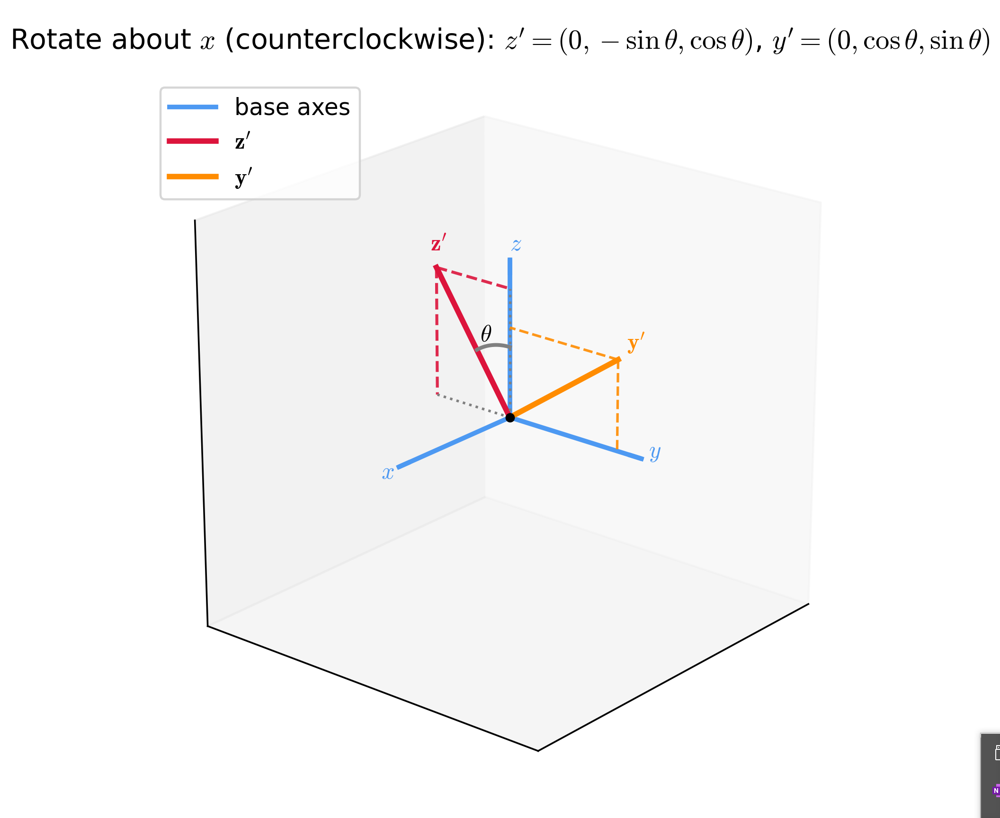
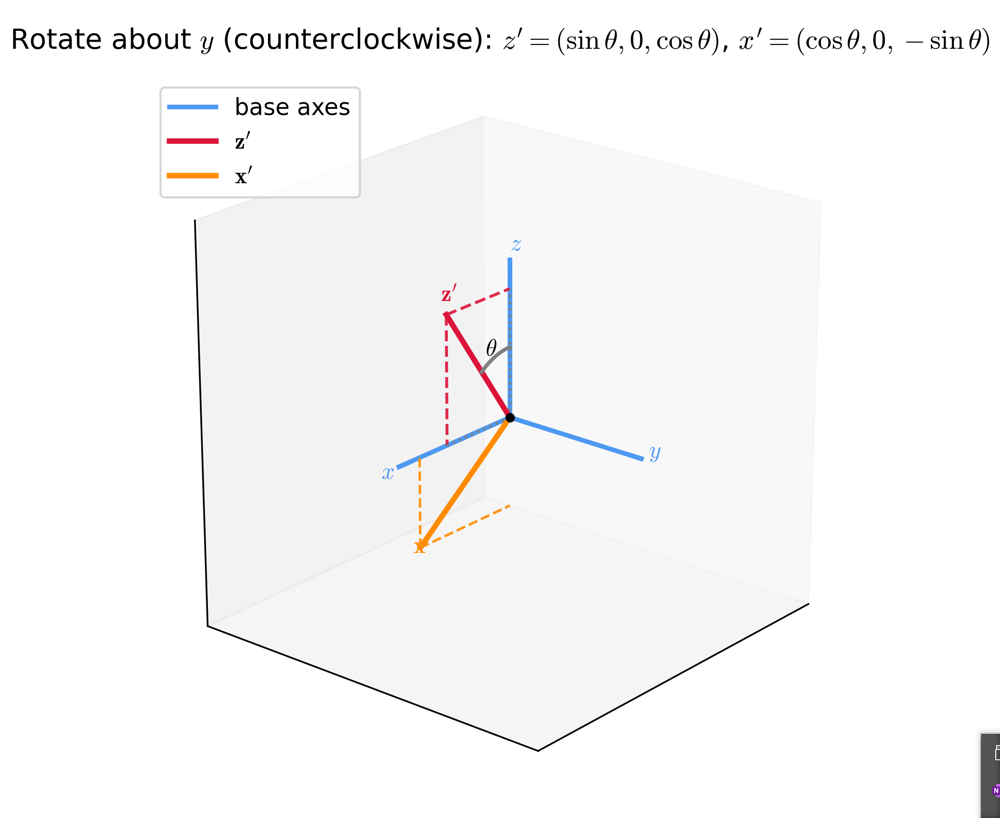
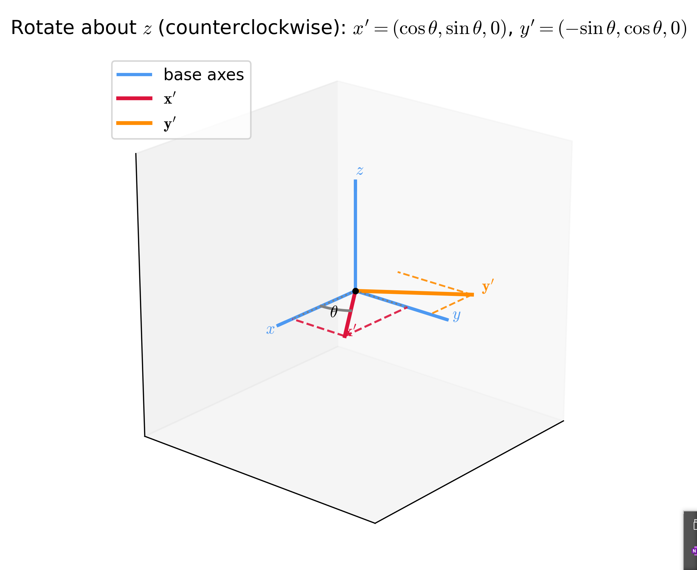

# 如何快速推导常见得二维以及三维旋转

## 二维旋转

https://zhuanlan.zhihu.com/p/102814853

如何推导二维旋转
首先看完上面得回答后，最直观得是第一个方法是，用极坐标得方式去推导，但是，这个推导方法其实并不是那么直观，同时无法往更高维度去推广，我推荐用第二个办法。

第二个方法的流程就是：
1.	计算出所有旋转后的基底
2.	用旋转后的基底乘上你的坐标值，即可得到旋转后的整体向量
主要的问题一般就集中在第二步，为什么基底竖着放并且凑起来就是一个旋转矩阵？
我们看看旋转后的向量究竟是如何计算的，假设原来旋转前的向量表示为
粗体向量表示法（推荐）：
$ \mathbf{p} = x \cdot \mathbf{e}_1 + y \cdot \mathbf{e}_2 $  ， 而旋转后的新向量其实是 $ \mathbf{p}' = x \cdot \mathbf{e}_1' + y \cdot \mathbf{e}_2' $，
然后你看下面我们写的，本质上就是这么一个过程
$$
p'
\;=\;
x 
\begin{bmatrix}
\,|\,  \\
e_1' \\
\,|\, \,
\end{bmatrix}

\;+\;
y
\begin{bmatrix}
\,|\,  \\
e_2' \\
\,|\, \,
\end{bmatrix}
\;=\;
\begin{bmatrix}
\,|\, & \,|\, \\
e_1' & e_2' \\
\,|\, & \,|\,
\end{bmatrix}
\begin{bmatrix}
x \\
y
\end{bmatrix}
$$

## 三维旋转

有了二维里面的做法后，我们其实只需要算出三维空间中的三个基底向量旋转后的向量即可 
$ \mathbf{i}' $，$ \mathbf{j}' $，$ \mathbf{k}' $。

需要提前确定的就是到底是用什么样的坐标系，这里我们以一个参考的坐标系为例子，其实用什么坐标系基本没变化，经常遇到的一个问题就是，不管用什么坐标系，三个矩阵的形式，至少有一个跟另外两个不一样，符号相反，那这是为什么呢？原因就在于我们的旋转是绕轴固定一个方向旋转的，这里我们统一采用逆时针旋转方向（右手法则），然后求出所有旋转后的基底，再凑成矩阵即可得到答案，不要用二维的推广，那个方法不本质。

那我们来总结下这三个旋转矩阵

$$
R_x(\theta)=
\begin{pmatrix}
1 & 0 & 0 \\
0 & \cos\theta & -\sin\theta \\
0 & \sin\theta & \cos\theta
\end{pmatrix},\quad
R_y(\theta)=
\begin{pmatrix}
\cos\theta & 0 & \sin\theta \\
0 & 1 & 0 \\
-\sin\theta & 0 & \cos\theta
\end{pmatrix},\quad
R_z(\theta)=
\begin{pmatrix}
\cos\theta & -\sin\theta & 0 \\
\sin\theta & \cos\theta & 0 \\
0 & 0 & 1
\end{pmatrix}
$$

你可以清晰看到，绕 y 轴旋转的和绕 x ，z旋转的不太一样，原因就是前面说的，一旦指定了右手准则的逆时针旋转方向，就会出现这个情况，这才是图形引擎中常用的。

## 线性变换

相信看到这里一定能想到，如果基底的变换只是线性变换，其实这个变换矩阵的计算都是一样的，都是先求出基底，再拼出矩阵。但是，什么是线性变换，本质其实就是我们前面提到的那个基底前的参数，也就是 $ \mathbf{p} = x \cdot \mathbf{e}_1 + y \cdot \mathbf{e}_2 $ ，这里面的 $ x $ 和 $ y $ 都是标量，只要变换后，这个标量还是一样的，那么我们都可以用这种方法。

